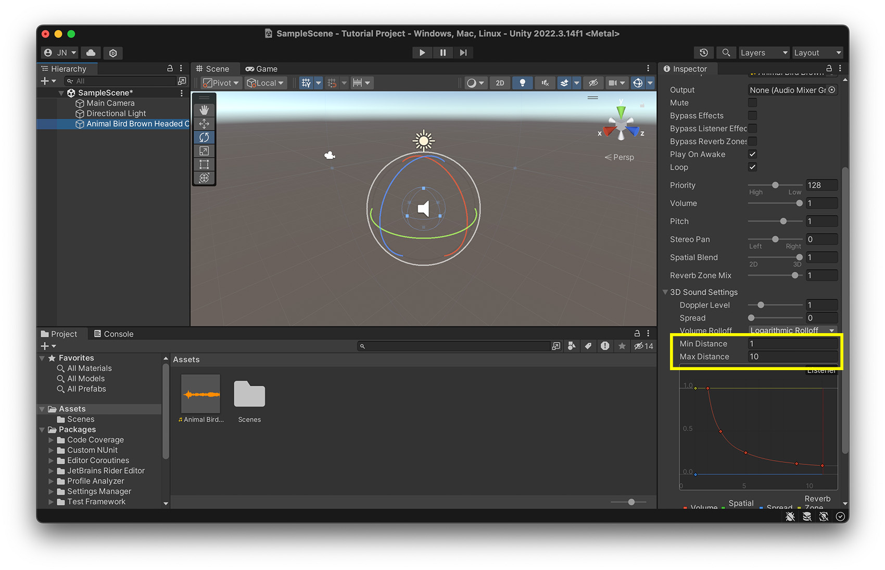

# Session 1

# <a name="project">Creating a new project

Go to the Unity Hub and click on "New project"

Then select "3D", choose a name for your project and click on "Create project"

# <a name="editor">Working with the Unity Editor

## General Unity Glossary

### Unity Hub
The Installer for different Unity versions and the place to open all of your Unity projects 

### Unity Editor 
The Unity programm itself, where you design your game 

### Build 
when you are finished with your game, you can export your game as a build, which means that the game can be played on different platforms without the Unity Editor. 

### Project 
The project consists of all the elements that make up your game, it is a folder on your harddrive. 

### Scenes 
Scenes are like levels in your game, each level usually is made out of one scene. In the scene you basically save how your Assets are linked to each other (how they are placed in the scene, how they interact etc.). You can have as many scenes as you like in your game and not every scene has to be in the final game. 

### Assets 
Assets are all Elements in Unity that are saved as a file on your computer. For example 3D-Objects, Materials, Scripts etc. 

### GameObjects
GameObjects are the virtual objects in your Unity Scene, they are not saved as a file in your assets folder, but they only exist within the scene. (If you want to create an Assets out of a GameObject you can create a PreFab.) 

### Component 
Components are the functional pieces of every GameObject. Each GameObject is made out of different components, e.g. the "Mesh Renderer" tells Unity that this is an object that should be rendered (should be visible) in the scene. 

## Unity Editor User Interface

### 1. Project windows: 
- a file explorer, where you can find all of your assets 
- Unity projects are always a folder consisting of different file types (in contrast to e.g. a Blender file). That means if you press save, you only save the current scene, the rest of your project in saved in the folder. 

> Data backups: always duplicate the entire folder, ideally always copy the entire folder before making major changes. Alternatively: Use a version control system like git. 

### 2. Hierarchy
- In the Hierarchy you can find all the GameObjects that are in your currently opened scene
- Here you can also see how the objects are arranged hierarchically (Parent-Child)

### 3. Inspector
- shows you all the Components that are part of the current GameObject when you select a GameObject
- also shows you the properties of all the Assets when you select an Assets
- allows you to change the properties of the different Components & Assets

### 4. Scene View 

- Displays the current 3D scene
- Move with: 
	- alt + left mouse button: Rotate
	- middle mouse button: Move or alt+cmd+left mouse button
	- Zoom: Mouse wheel/two fingers (up/down)/control+option+left mouse button
	- double-click on object: focus on object 
- Use the Scene Gizmo (a) to switch to a single axis view 
- You can switch between 2D & 3D view (b) (helpful for UI work)
- You can change the perspective mode (c)
- Toggle visibily of gizmos (d)
- Tools to move/rotate/scale objects (e)

### 5. Game View 
- shows the game as it will look later when the player will play it
- if you press "Play" at the top of the screen, a preview of how the game will look later is displayed here 
- here you can preview the game in different screen sizes etc. 
- most of the animations/scripts etc. only run when you have pressed play

### 6. Toolbar 
- Control the Game Mode of the current scene

### 7. Menubar
- can be used to create Assets, GameObjects, change the window-arrangement, save the current scene etc. 

You can find a Cheat Sheet with the Basic Unity UI Elements here: 
https://github.com/juliannetzer/arfoundation-demos_khb_sose22/blob/master/Handouts/220501_UnityCheatsheet.pdf

## Further tutorials for getting started in Unity: 
- [Everest Pipkin: Quickstart Unity 3d ](https://docs.google.com/document/d/1xwGpjgIRhZAqprW-jECGN1WNh_o2jfO_84hjLQ59TIQ/edit)
- [Brackeys: How to make a Video Game - Getting Started](https://www.youtube.com/watch?v=j48LtUkZRjU&list=PLPV2KyIb3jR5QFsefuO2RlAgWEz6EvVi6)
- [Ray Wenderlich: Unity Getting started](https://www.kodeco.com/7514-introduction-to-unity-getting-started-part-1-2)
- [The Ultimate Beginner Guide to Unity](https://www.freecodecamp.org/news/the-ultimate-beginners-guide-to-game-development-in-unity-f9bfe972c2b5/)

# Working with 3D Assets

To import Assets into your project, just drag and drop them into the "project"/Assets-window

Supported file formats: 
- .fbx (usually works best) 
- .obj 
- .dae
- .3ds
- .dxf

Note: you can also use other file formats (link .blend etc. if the corresponding software is installed but i wouldn't recommend it) 

[Unity Documentation on file formats](https://docs.unity3d.com/2020.1/Documentation/Manual/3D-formats.html)

## Best places to get free 3D-Assets 

- [Unity Asset Store](https://assetstore.unity.com/?category=3d%2Fenvironments&free=true&orderBy=1): Large library of assets, specifically for unity, sometimes with animations 
- [Sketchfab](https://sketchfab.com): Large library for free Assets, also from museums etc., mixed quality & licenses 
- [Polyhaven](https://polyhaven.com/models): Not that many models, but all can be used for any purpose (commercial and personal)
- [Everything library](https://www.davidoreilly.com/library): library of objects from the (very good) game "Everything", see hint below, a lot of models, all in the same style (low poly), can be used in all projects, but an attribution is necessary[license](https://creativecommons.org/licenses/by/4.0/)
- [NASA 3D Models](https://nasa3d.arc.nasa.gov/models): library of space related objects, different quality, but some are quiet nice
- [Three D Scans](https://threedscans.com/): library of 3d scanned statues & some animals, very detailed 
- [ArtStation](https://www.artstation.com/marketplace/game-dev/assets?section=free): Plattform, mixed quality, different
- [Quaternius](https://quaternius.com/): nice low poly packs, most of them free to use
- [OpenGameArt](https://opengameart.org/art-search-advanced?keys=&field_art_type_tid%5B%5D=10&sort_by=count&sort_order=DESC): a lot, mixed quality
- [Dimensiva](https://dimensiva.com/free-3d-models/): mostly furniture

> Trees are rather difficult to render in Unity, so either use Low-Poly Versions, or you can also find some in the Assets Store (e.g. [Realistic Pines](https://assetstore.unity.com/packages/3d/vegetation/trees/realistic-pine-tree-pack-232166), [Polygon Trees](https://assetstore.unity.com/packages/3d/vegetation/trees/polygon-trees-224068))

## Online Sculpting Tools
- [SculptGL](https://stephaneginier.com/sculptgl/)
- [Monster Mash](https://monstermash.zone/)

#  Materials/ Shaders/ Textures 

Every 3D-Assets in Unity needs a material that is attached to it, and every material needs a shader. The material is the place where the information like colors and textures are stored. The shader then tells unity how to render these information. (you can compare it to using a pencil: the material stores the color, the shader stores whether it is a wax crayon or a colored pencil). 

Most materials have a certain set of textures (images) applied. The most important ones in Unity are: 
- Albedo/ Base Map
- Specular Map
- Normal Map
- Height Map 
- Occlusion Map

## Create a new material: 

Click on Assets -> Create -> Material

Now you can add some textures and change the colors. 
To apply the material to an object, just drag and drop it onto the object. 

### Best Places to get free Textures: 
- [Polyhaven](https://polyhaven.com/textures)
- [Unity Asset Store](https://assetstore.unity.com/?category=2d%2Ftextures-materials&free=true&orderBy=1)
- [AmbientCG](https://ambientcg.com/)
- [Ponzu (AI generated Textures)](https://www.ponzu.gg)

### Settings for Polyhaven: 

- Resolution: 2K (or on better machine, or complex textures 4K)
- ZIP 
- .JPGs (or for better quality .PNG)

Conversion Table for using Polyhaven Materials: 
| Unity            | Polyhaven   |
| ---------------- | ----------- |
| Albedo/ Base Map | Diffuse     |
| Specular Map     | Spec        |
| Normal Map       | Normal (GL) |
| Height Map       | Displacement|
| Occlusion Map    | AO          |

## Troubleshooting

### Material is displayed pink: 
Probably a problem with the renderpipeline, find the material in the project window, select it and then click on "Edit -> Rendering -> Materials -> Convert Selected Built-in Materials to URP". If this does not work, either create a new material and assign it, or if you can get the asset in a different fileformat try that. 

### Imported object does not have a color/texture 
- See whether the asset comes with a "material" or "texture" folder, if yes, try: 
	- select the 3D-model in the project window, and go to the "Materials"-Tab in the Inspector window, select Location -> Use External Materials (Legacy) and click "Apply"
	- If this does not work: switch to Location -> Use Embedded Materials again and click on "Extract Materials" and then on "Apply". This extract the Materials from the model and you can manually assign the textures/colors etc. 
- If it does not come with an extra folder: 
	- select the asset in the Project window and click on "Extract Textures" and/or "Extract Materials" in the Inspector (in the "Materials" Tab)
	-  If there are still no materials/textures you have to manually create them/ or find a new asset

# Audio 

To add sound to a scene create a new Audio Source: GameObject -> Audio -> Audio Source. Or drag and drop your soundfile in the Sceneview. 

- [Tutorial: Sound Component in Unity](https://learn.unity.com/tutorial/working-with-audio-components-2019-3)

Supported file formats: 
- AIFF 
- WAV 
- MP3
- Ogg 

Places to get (free) sounds: 
- [Adobe Creative Cloud](https://www.adobe.com/products/audition/offers/AdobeAuditionDLCSFX.html)
- [Unity Asset Store](https://assetstore.unity.com/?category=audio&free=true&orderBy=1)
- [freesounds.org](https://freesound.org/people/Nox_Sound/)
- [OpenGameArt](https://opengameart.org/art-search-advanced?field_art_type_tid%5B%5D=13)
- [Soundcloud](https://soundcloud.com/)

> Tutorial how to work with Audio Tracks in the timeline: [Unity Learn: Audio and the Timeline](https://learn.unity.com/tutorial/working-with-audio-tracks-in-timeline#5f6126e3edbc2a0020034db9)

## Spatial Audio

Spatial Audio works in Unity out of the box. If you have created an audio source in unity, you can use the "Spatial Blend" value to set how much the positioning of the audio source affects the volume and audible direction of the source. 

With "Min Distance" and "Max Distance" you can set the minimum and maximum distance of audibility. 

With the "Volume Rolloff" you can select different Rolloff algorithms. Select "Linear Rolloff" if you want to hear a strong difference based on the positioning, "Logarithmic Rolloff" for a more realistic effect. 

