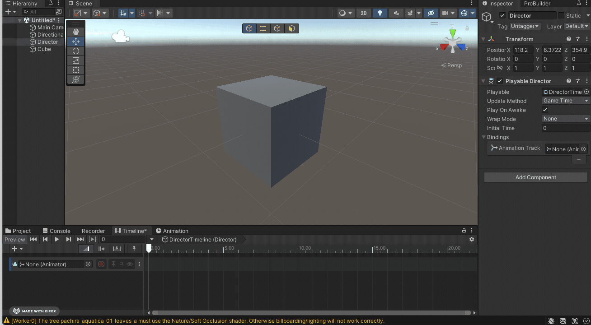

# Session 2 - Animating, Lighting, XR 

# Animations 

## Animations window 

To animate an object, open the "Animation" window (Window -> Animation -> Anmation). 
Then select the GameObject you want to animate in the hierarchy window, now you should see this in the Animation Window: 

Click on "Create" this creates an *Animation Clip*.

Now you can start to animate your object either by hitting the record button:

or by manually adding the properties and keyframes: 

See also:
- [Tutorial Animation in Unity](https://learn.unity.com/tutorial/working-with-animations-and-animation-curves#)

By default the Animation will loop, if you only want it to play once select the Animation Clip in the Project window and untick "Loop Time" in the Inspector. 

> This method works best when you want to animate a single objects, like a spinning light. If you want to animate multiple objects together and the timing is importing, like for example a cinematic scene, or a transition scene then the "Timeline"-feature works better. 

## Animator window

*Note: we don't need the animator window for our course, but it's easier to understand the Unity Animation system if you know about it* 
The Animator selects when your animation clips will be played, for example when you want to create a Character that has different states (like walking, standing, running) and one animation clip for each state you would animate this in the Animator window (in general: non-linear animations). In this case you would need a little bit of coding, you can find a tutorial here: 
https://www.youtube.com/watch?v=tveRasxUabo

## Timeline

The Timeline works best if you want to create a linear sequence of animations, like a transition scene or in our case a little movie sequence. 

To work with the Timeline open the Timeline window (Window -> Sequencing -> Timeline). 
Then create an empty GameObject (GameObject -> Create Empty) and name it "Director", this GameObject will control our movie sequence (and also our cameras later). 

> You can click on the settings wheel on the upper right side and choose whether you wanna work in seconds or in frames. 

### Activating Objects in the Timeline
With the timeline you can easily activate and deactivate objects. Right-click on the left side of the Timeline window and select "Activation Track" then drag and drop the GameObject you want to activate and deactive in the selector field. 

You can also change the time when and for how long your object should be active

### Animate Objects
You can also animate object in the same way as in the Animation window, but in the Timeline window you can directly see the timing for the whole scene, in case the animation should happen at a specific point in time. 
Right click on the left side again and select "Animation Track" (always make sure that the "Director" GameObject is selected in the hierarchy) then drag and drop the object you want to animate in the selector field and click on record. 

> Here you can find some information about the other tracks you can use with the timeline: [Overview of the Timeline-Features](https://lukeduckett.medium.com/it-all-comes-down-to-timing-a-quick-guide-to-timeline-in-unity-fd96b26820f4),[Control Track](https://christopherhilton88.medium.com/what-is-a-control-track-in-timeline-f70588662cce), [Signal Track](https://blog.unity.com/technology/how-to-use-timeline-signals), [Playable Track](https://docs.unity3d.com/2018.3/Documentation/ScriptReference/Timeline.PlayableTrack.html)

# Lighting the Scene

## Realtime Lights 
Realtime lights calculate the lightrays in realtime, that means you can move the lights, move the object that catch shadows from the light without any prerendering. 

There are three types of lights: Spotlight, Pointlight, Directional ligth

## Baked Lights
For more advanced lighting you can bake your light, that means you prerender your lightmap which is then like a fixed texture on the object. You can't move the light source or the objects that get illuminated without recalculating the light. 

Two examples for baked lights are: area lights and skyboxes. 

To see the effect of a baked light, you have to set the object to static which you want to illuminate: 
Select the object in the hierarchy and select Static -> Contribute GI 

Then go to the "Lighting"-window (Window -> Rendering -> Lighting) and click on "Generate Lighting" (make sure the "Auto-Generate"-Box is not ticked)

## Skyboxes 
Skyboxes can be used to very easily create a complex lighting (and background) for a scene. It's basically a sphere around the scene that is filled with a texture, that illuminate the scene. 

To use a skybox go the lighting window (Window -> Rendering -> Lighting) and select the skybox material: 

(Note: You have to click on "Generate Lighting" and your Objects need to be static)

Best places to find skyboxes: 
- [Polyhaven](https://polyhaven.com/hdris)
- [Unity Asset Store](https://assetstore.unity.com/2d/textures-materials/sky)

### Importing a skybox (from Polyhaven)
Download the skybox as .exr (i would recommend 4k resolution, if you wanna see the skybox in the background, if not 1k should be enough). 

Import to Assets, then select the image in the Project Window and go to the inspector and select texture shape -> 

Then create a material (Assets -> Create -> Material) go the inspector and search for "Cubemap" in the shader dropdown. 

Then you can drag and drop the image that you imported in the cubemap area. 

Now you can use the skybox in the lighting settings. 

# Recording

The easiest way to record videos is the *Unity Recorder* (Window -> General -> Recorder -> Recorder Video). Then click on "Add Recorder" and choose "Movie", here are the preferences that i recommend: 

*Please make sure that the path you selected is not inside your Unity project*

> If you can't find the Recorder in your Unity Project you can install it via the Package Manager: Window -> Package Manager. For the packages (upper left corner) choose "Unity Registry", search for "Recorder" and click "Install"

> The recorder also offer the possibilty to record 360°-video. In this case use at least 4k as a resolution. 

> If the image quality is not good enough you can export an image sequence (e.g. .PNG) and then create the video in Premiere or in other video editing softwares. 

